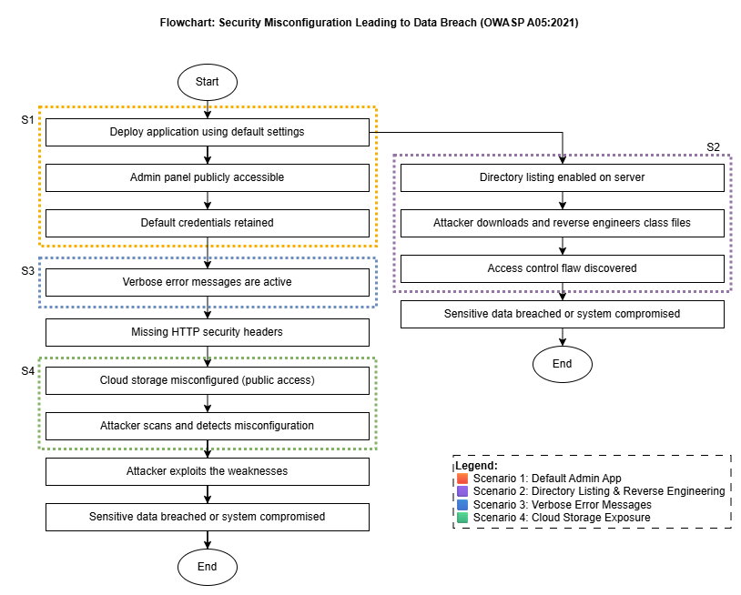
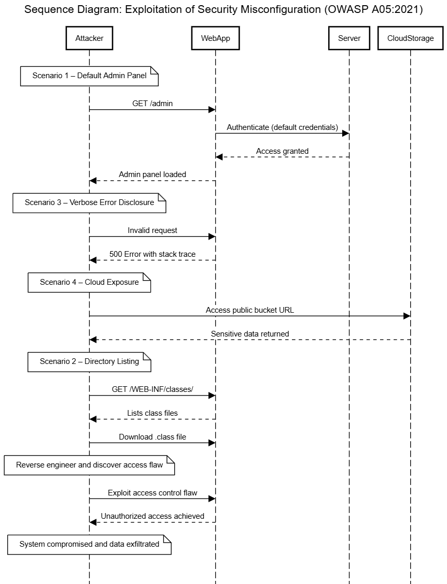

# Unit 1 Summary – Security Misconfiguration (OWASP A05:2021)

## 🧠 Key Learning

This unit introduced foundational concepts of secure software development and modelling techniques using UML. The OWASP Top 10 framework was especially helpful in understanding real-world vulnerabilities. I focused on **A05:2021 – Security Misconfiguration**, which resonated with me because it's both common and dangerous in live systems.

We explored modelling as a communication tool using **flowcharts** and **sequence diagrams** to represent attacks and defence mechanisms. This was my first time applying UML to represent cybersecurity scenarios, and it clarified how bad configurations can chain into serious breaches.

---

## 💬 My Discussion Post

**Topic:** OWASP A05:2021 - Security Misconfiguration  
**Posted:** 19 May 2025  
**By:** Mobeen Ali

> One of the most widespread and critical vulnerabilities in the OWASP Top 10 is A05:2021 - Security Misconfiguration. This vulnerability occurs when security settings are left in their default state or are misconfigured, often exposing sensitive systems and data to attackers.  
>  
> Common examples include leaving default accounts enabled, enabling verbose error messages, improper cloud storage permissions, and failure to enforce secure headers (OWASP, 2021).  
>  
> To explore the risk, I used "draw.io" to create a detailed flowchart that maps out four realistic scenarios (S1–S4) that demonstrate how a security misconfiguration may lead to a full system compromise.  
>  
> I also created a **sequence diagram** using "sequencediagram.org" to show how attackers exploit vulnerabilities across multiple misconfigured components like the web app, server, and cloud storage. These tools helped visualise the full threat chain and gave me insight into attacker thinking.  

---

## 📊 Artefacts

### 🔸 Flowchart: Security Misconfiguration Leading to Data Breach

### 🔸 Sequence Diagram: Exploitation of Security Misconfiguration

---

## 📚 References

OWASP Top 10 team (2021) *A05:2021 - Security Misconfiguration*. Available at: https://owasp.org/Top10/A05_2021-Security_Misconfiguration/ (Accessed: 13 May 2025).

draw.io (no date) *Free Online Diagram Software*. Available at: https://app.diagrams.net (Accessed: 15 May 2025).

sequencediagram.org (no date) *Free Online Sequence Diagram Tool*. Available at: https://sequencediagram.org (Accessed: 17 May 2025).
