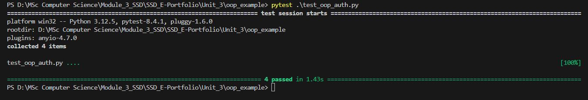

# Unit 3 Summary – Programming Languages: History, Concepts, and Design

## 🧠 Key Learning

Unit 3 focused on the evolution of programming languages and how their core paradigms influence software quality and security. I gained insight into how language features such as **abstraction**, **encapsulation**, and **inheritance** especially in Python, support secure and modular development.

The unit also highlighted how poor design choices at the language or architectural level can result in insecure systems. Understanding **design patterns** and Pythonic practices helped me apply a security-first mindset during software design and implementation.

---

## 🛠 Artefact: Object-Oriented Authentication Example

To apply the principles discussed, I developed a Python-based authentication system that demonstrates:

- **Encapsulation**: Passwords are stored as hashed attributes.
- **Abstraction**: Internal hashing and verification logic is hidden.
- **Inheritance**: An `AdminUser` subclass extends the `User` class with additional features.
- **Security**: Uses `bcrypt` for secure password hashing, in line with best practices.

📄 File: `oop_auth_example.py`

---

## 🧪 Testing Secure Functionality

I implemented a dedicated test suite using `pytest` to verify the following:

- Password checking works for correct and incorrect input
- Admin user correctly inherits base functionality
- Passwords are never stored in plaintext

📄 File: `test_oop_auth.py`

### ✅ Test Results

Below is a screenshot of test execution showing all 4 unit tests passing:

---

## 📚 References

Romano, F. and Krüger, H. (2021) *Learn Python Programming: The Definitive Guide to Writing Clean Python Code*. 4th edn. Birmingham: Packt Publishing.

Van Rossum, G., Warsaw, B. and Coghlan, N. (2001) *PEP 8 – Style Guide for Python Code*. Python Software Foundation. Available at: https://peps.python.org/pep-0008/ (Accessed: 17 July 2025).

Olmsted, A. (2020) *Security-Driven Software Development: Defending the Digital Frontier*. Boca Raton: CRC Press.
