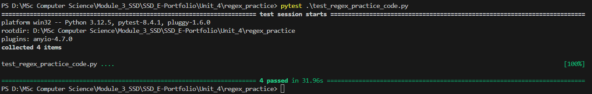
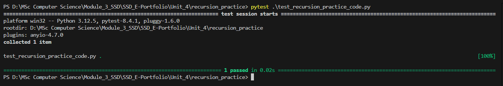

# Unit 4 Summary – Regular Expressions, Recursion, and System Security

---

## Key Learning

This unit dissected how **Regular Expressions (Regex)** and **Recursion** serve as potent programming constructs, yet simultaneously introduce critical security liabilities when misapplied.

### From a security engineering standpoint:

- Poorly constructed Regex patterns can lead to **Regular Expression Denial of Service (ReDoS)**, triggered by catastrophic backtracking and resulting in exponential Central Processing Unit (CPU) load.
- Uncontrolled recursive logic may cause **Stack Overflow**, manifesting in application crashes, memory corruption, or service unavailability.

> Conclusion: Native programming features are not implicitly secure. **Every line of logic is a potential attack surface unless purposefully hardened**.

---

## Artefacts

### 🔹 [`regex_practice/regex_practice_code.py`](../Unit_4/regex_practice/regex_practice_code.py)

Python script that:

- Validates email addresses using a strict, efficient Regex pattern.
- Demonstrates an intentionally vulnerable pattern `(a+)+$` designed to simulate catastrophic backtracking.

### 🔹 [`recursion_practice/recursion_practice_code.py`](../Unit_4/recursion_practice/recursion_practice_code.py)

Python script that:

- Recursively enumerates file paths in a directory tree.
- Enforces a `max_depth` parameter to prevent infinite descent and mitigate **Denial of Service (DoS)** via stack saturation.

---

## Testing & Results

Dedicated test modules were developed to verify both functional correctness and resilience against misuse or attack input.

### [`regex_practice/test_regex_practice.py`](../Unit_4/regex_practice/test_regex_practice_code.py)

- Validates correct and malformed email inputs.
- Confirms protection against backtracking-triggering input without raising runtime exceptions.

📷 

### [`recursion_practice/test_recursion_practice.py`](../Unit_4/recursion_practice/test_recursion_practice_code.py)

- Dynamically generates nested folder structures using `tmp_path` for isolation.
- Verifies recursion respects the `max_depth` constraint and terminates safely.

📷 

---

## References

OWASP Foundation (2021) *Regular Expression Denial of Service (ReDoS)*. Available at: [https://owasp.org/www-community/attacks/Regular_expression_Denial_of_Service](https://owasp.org/www-community/attacks/Regular_expression_Denial_of_Service) (Accessed: 17 July 2025).

Romano, F. and Krüger, H. (2021) *Learn Python Programming: The Definitive Guide to Writing Clean Python Code*. 4th edn. Birmingham: Packt Publishing.

Olmsted, A. (2020) *Security-Driven Software Development: Defending the Digital Frontier*. Boca Raton: CRC Press.
