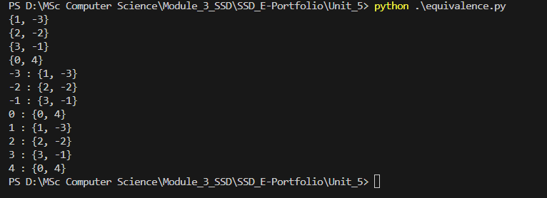

# Unit 5 Summary – Introduction to Testing for Secure Software

## 🧠 Key Learning

In Unit 5, I explored a range of software testing strategies relevant to secure development, including test planning, test automation with `pytest`, and logic complexity via **Cyclomatic Complexity**.

A key part of this unit was the application of **Equivalence Partitioning**, which helps reduce the number of test cases while maintaining meaningful coverage. I also analyzed how logic complexity correlates with security risks when input validation or control flow is not well structured.

---

## 🛠 Artefacts

### 🔹 `equivalence.py`

This script demonstrates equivalence partitioning on integers from `-3` to `4`, using the relation `(x - y) % 4 == 0`. It groups input values into **equivalence classes** such that all values in a group return `True` when compared pairwise using the defined relation.

#### ✅ Observed Output:

{1, -3}
{2, -2}
{3, -1}
{0, 4}
1 : {1, -3}
2 : {2, -2}
3 : {3, -1}
0 : {0, 4}
4 : {0, 4}
-2 : {2, -2}
-3 : {1, -3}
-1 : {3, -1}

#### 📷 Equivalence Partitioning Output

Below is the result of executing `equivalence.py`, confirming the function correctly grouped inputs using the relation `(x - y) % 4 == 0`:

#### 🔍 Interpretation:

- The function partitions data by **logical equivalence** instead of equality.
- Helps identify **redundant test inputs** by grouping values that behave identically under the system's logic.
- This principle is vital in security-focused systems where **edge case enumeration** must balance coverage and performance.

---

## 📊 Cyclomatic Complexity

I manually evaluated the recursive function from Unit 4 and determined:
- Entry point: 1
- Decisions: 4
- Complexity Score ≈ 5

This confirms that even small utility functions can have branching logic requiring dedicated test cases.

---

## ✅ Reflection

This unit reinforced that **security testing is both structural and logical**. Cyclomatic complexity, equivalence partitioning, and traditional testing all provide different but necessary views into how software may fail or be exploited. I am now more intentional about how I write and test functions to avoid untestable logic and silent failures.

---

## 📚 References

McCabe, T.J. (1976) ‘A Complexity Measure’, *IEEE Transactions on Software Engineering*, SE-2(4), pp. 308–320. https://doi.org/10.1109/TSE.1976.233837

Olmsted, A. (2020) *Security-Driven Software Development: Defending the Digital Frontier*. Boca Raton: CRC Press.

Romano, F. and Krüger, H. (2021) *Learn Python Programming: The Definitive Guide to Writing Clean Python Code*. 4th edn. Birmingham: Packt Publishing.

Stack Overflow (2016) *Is there a standard way to partition an iterable into equivalence classes given a comparison function?* Available at: https://stackoverflow.com/a/38924631 (Accessed: 17 July 2025).
