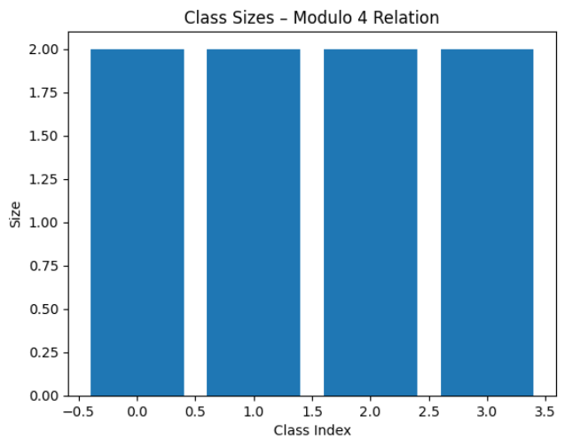
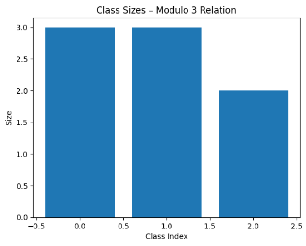

# Unit 5 Summary – Introduction to Testing for Secure Software

## Key Learning

In Unit 5, I explored a range of software testing strategies relevant to secure software development, including test planning, automated testing using `pytest`, and the analysis of logic complexity through **Cyclomatic Complexity**.

A core focus of the unit was on **Equivalence Partitioning**, a test design technique that reduces the number of test cases required by identifying logically equivalent inputs. I applied this concept to partition integers using a relation function and observed how it supports meaningful test coverage while minimising redundancy. I also examined the impact of logic complexity on software reliability and its relationship to security risks, particularly when input validation is poorly structured.

---

## Artefacts

### `equivalence.py`

This script demonstrates equivalence partitioning on the integer range `[-3, 4]`, using the relation `(x - y) % 4 == 0`. It groups input values into **equivalence classes** such that all members of a class satisfy the given relation when compared pairwise.

#### Observed Output

```
{1, -3}
{2, -2}
{3, -1}
{0, 4}
1 : {1, -3}
2 : {2, -2}
3 : {3, -1}
0 : {0, 4}
4 : {0, 4}
-2 : {2, -2}
-3 : {1, -3}
-1 : {3, -1}
```

#### Visual Output – Modulo 4 Relation

The following bar chart visualises the size of each equivalence class under the `(x - y) % 4 == 0` relation:



All four equivalence classes have equal size, confirming the balanced distribution for this relation.

---

### Extension: Alternate Relation `(x - y) % 3 == 0`

To further investigate equivalence partitioning, I modified the relation to `(x - y) % 3 == 0` and reran the function.

#### Output under Modified Relation

```
{0, 3, -3}
{1, 4, -2}
{2, -1}
```

#### Visual Output – Modulo 3 Relation



Here, the class sizes vary, demonstrating how the choice of relation affects the equivalence structure and test coverage strategy.

---

### Comparison and Insights

- The `(x - y) % 4 == 0` relation produced **4 balanced equivalence classes** of 2 values each.
- The `(x - y) % 3 == 0` relation produced **3 uneven classes**, with one class containing only 2 values.
- This comparison underscores how equivalence logic directly influences input grouping, making it a valuable technique in designing **efficient and targeted test suites**.

---

## Cyclomatic Complexity

I manually evaluated a recursive utility function and found:
- Entry point = 1
- Decision points = 4
- Cyclomatic Complexity = 5

This shows that even small functions can introduce meaningful branching logic, warranting dedicated test cases to ensure reliability and predictability—particularly relevant for security-focused systems.

---

## Reflection

This unit reinforced the idea that **security testing requires both logical design and structural discipline**. Equivalence partitioning helped me understand how logically equivalent input classes can reduce testing redundancy without compromising coverage. Cyclomatic complexity emphasized the importance of controlling decision paths to mitigate hidden logic errors. These practices improve not just correctness but also the system’s ability to withstand edge-case exploits or misuse.

---

## References

McCabe, T.J. (1976) ‘A Complexity Measure’, *IEEE Transactions on Software Engineering*, SE-2(4), pp. 308–320. https://doi.org/10.1109/TSE.1976.233837  

Olmsted, A. (2020) *Security-Driven Software Development: Defending the Digital Frontier*. Boca Raton: CRC Press.  

Romano, F. and Krüger, H. (2021) *Learn Python Programming: The Definitive Guide to Writing Clean Python Code*. 4th edn. Birmingham: Packt Publishing.  

Stack Overflow (2016) *Is there a standard way to partition an iterable into equivalence classes given a comparison function?* Available at: https://stackoverflow.com/a/38924631 (Accessed: 17 July 2025).
