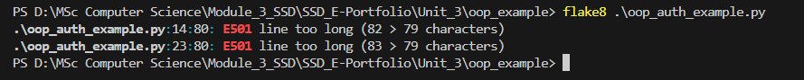
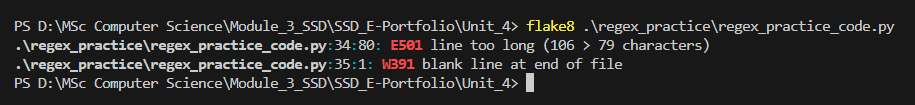
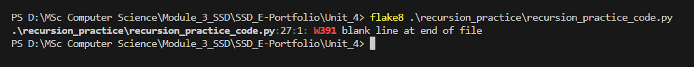

# Unit 6 Summary – Using Linters to Support Secure Python Development

## 🧠 Key Learning

This unit introduced the role of **linters** like `flake8` and `bandit` in achieving code quality and enforcing secure coding standards. The idea that **clean code is more secure code** was a key insight, linters help identify both logical errors and risky coding patterns before runtime.

We also finalized and submitted our **Design Document** as a team, which helped crystallize the CLI application's architecture. The work involved translating OWASP risks into design elements (e.g., hashing, 2FA, secure storage) and visualizing them using UML diagrams. This became the foundation for my solo implementation.

---

## 📁 Artefacts

## 📝 Design Document & Instructor Feedback

### 🔹 Group Design Document

As part of Unit 6, our team collaboratively created a detailed design document outlining the architecture, security risks, implementation tools, and modular breakdown of our secure CLI application. This document formed the foundation for our individual development in Unit 11.

📄 File: [`Secure_Software_Development_Group_Project_Design_Document.docx`](./Secure_Software_Development_Group_Project_Design_Document.docx)

Key sections included:
- OWASP-based risk identification and mitigation strategies
- Class and misuse activity diagrams
- Functional and non-functional requirements
- Tools and libraries chosen for secure Python development
- Project timeline and solo development approach

### 🔹 Tutor Evaluation & Feedback

We received written peer evaluation and formative feedback from our tutor, which confirmed strong team collaboration and highlighted opportunities to strengthen certain areas like role clarity and consistent use of terminology. It also praised the UML structure and real-world threat mapping.

📄 File: [`Peer Evaluation - Design Document.docx`](./Peer Evaluation - Design Document.docx)

Feedback was considered seriously and helped guide the final updates we made prior to submission. I used this input to improve clarity in my own implementation and documentation during the solo development phase.

### 🔹 `flake8` Code Quality Analysis

To ensure my code adhered to **PEP8 standards**, I used `flake8` to analyze the following scripts:

- [`oop_auth_example.py`](../Unit_3/oop_example/oop_auth_example.py)
- [`regex_practice_code.py`](../Unit_4/regex_practice/regex_practice_code.py)
- [`recursion_practice_code.py`](../Unit_4/recursion_practice/recursion_practice_code.py)

The linter helped identify several early issues, including:
- Line length violations
- Indentation inconsistencies
- Unused imports

After addressing all warnings, each script passed with **zero major PEP8 violations**, demonstrating adherence to Python best practices for readability and maintainability.

Below are the `flake8` analysis results for each script:

#### `oop_auth_example.py`

#### `regex_practice_code.py`

#### `recursion_practice_code.py`

---

## 🤝 Team Collaboration

We held several structured team meetings via Zoom to develop the design document, assign responsibilities, build diagrams, and prepare for tutor review.

📁 The following meeting records are included:
- [30-May-2025 Meeting Minutes](./team_meetings/30May2025_meeting-minutes.txt)
- [04-June-2025 Meeting Minutes](./team_meetings/04June2025_meeting-minutes.txt)
- [05-June-2025 Meeting Minutes](./team_meetings/05June2025_meeting-minutes.txt)
- [08-June-2025 Meeting Minutes](./team_meetings/08June2025_meeting-minutes.txt)

These records document our full collaboration cycle:
- Task assignments
- Diagram creation
- Word count planning
- Integration of OWASP risks
- Tutor meeting scheduling
- Final design review and submission planning

🔗 **Team Meeting Recordings**: [Watch recordings](https://1drv.ms/f/c/2465e7dfd9d61c67/Es5_eFzPN6RLvoBI1SIhXIoB4bfXI6hBdtQmlvY6dBawmg?e=l49K4N)

---

## 📚 References

Romano, F. and Krüger, H. (2021) *Learn Python Programming: The Definitive Guide to Writing Clean Python Code*. 4th edn. Birmingham: Packt Publishing.

Olmsted, A. (2020) *Security-Driven Software Development: Defending the Digital Frontier*. Boca Raton: CRC Press.

Python Software Foundation (2001) *PEP 8 – Style Guide for Python Code*. Available at: https://peps.python.org/pep-0008/ (Accessed: 17 July 2025).

OWASP Foundation (2021) *OWASP Top Ten – Security Risks*. Available at: https://owasp.org/Top10 (Accessed: 17 July 2025).
